# Citi-Bike-PowerBI-Analysis

This project takes the data compiled from Citi Bike's Jersey City publicly available source (https://s3.amazonaws.com/tripdata/index.html) and cleaned as part of the [Citi-Bike-Tableau Analysis project](https://github.com/vt-bekah/Citi-Bike-Tableau-Analysis) and creates some basic reports using Power BI. For more details on the data collection and cleaning, refer to that project. 

The Power BI file (pbix) is large and thus not uploaded to this repository. The analysis files ([2018-2022_JC-CitiBike_Analysis.pdf](https://github.com/vt-bekah/Citi-Bike-PowerBI-Analysis/blob/main/2018-2022_JC-CitiBike_Analysis.pdf), [2018-2022_JC_CitiBike_Analysis.pptx](https://github.com/vt-bekah/Citi-Bike-PowerBI-Analysis/blob/main/2018-2022_JC_CitiBike_Analysis.pptx)) show the report views upon opening the file. The screenshots below indicate some of the interactive capability of the reports.

### Monthly Usage by Starting Station

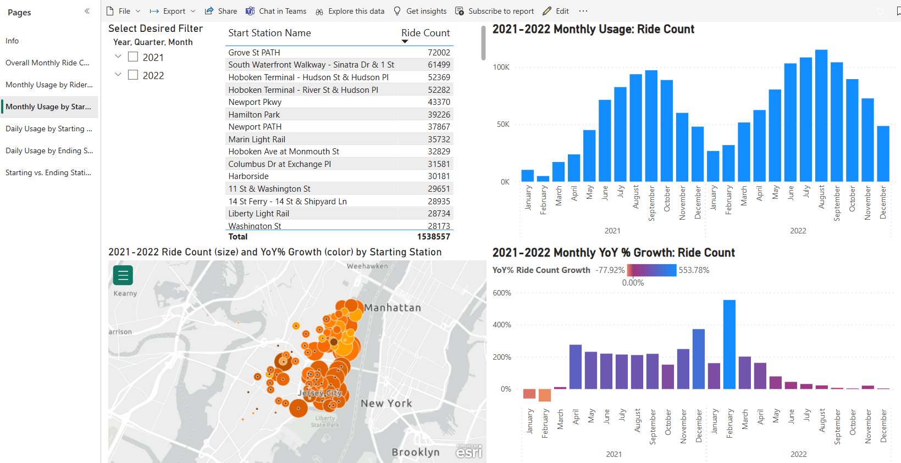

Selecting the last 6 months of 2022 | Selecting the top 10 stations by count in 2022 
:-------------------------:|:-------------------------:
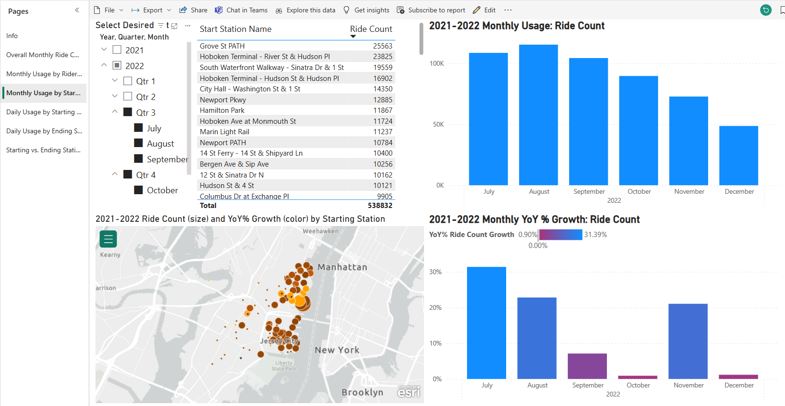  |  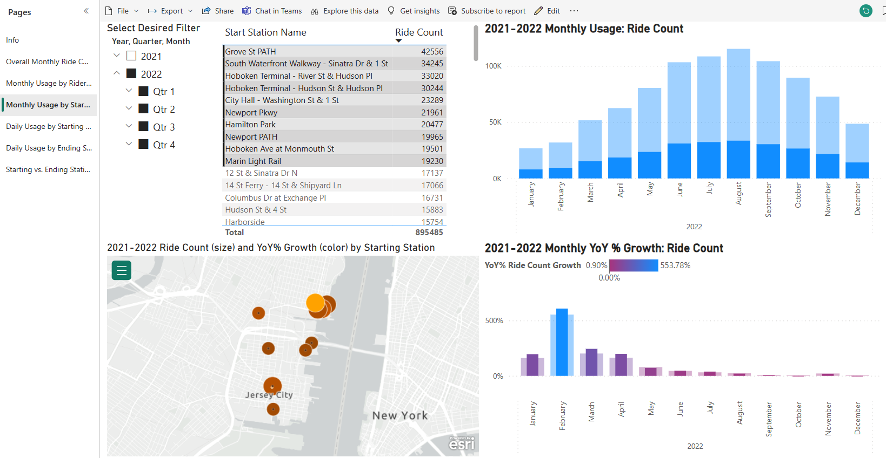

### Daily Usage by Starting Station

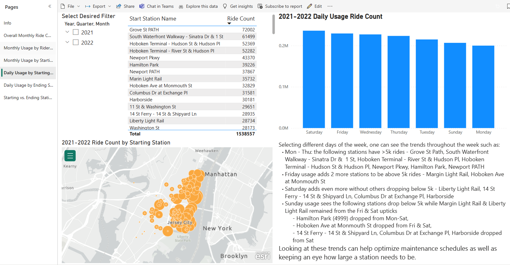

Selecting the top 10 stations by count during the *summer* week 2022 | Selecting the top 10 stations by count on the *summer* weekend 2022
:-------------------------:|:-------------------------:
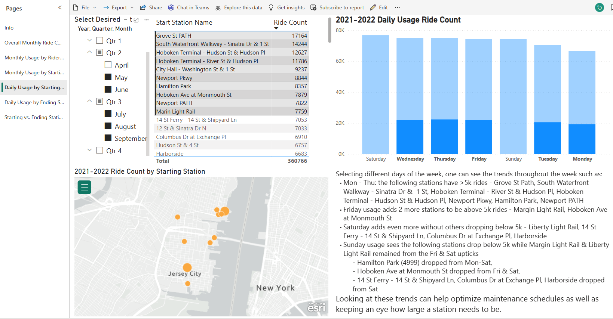  |  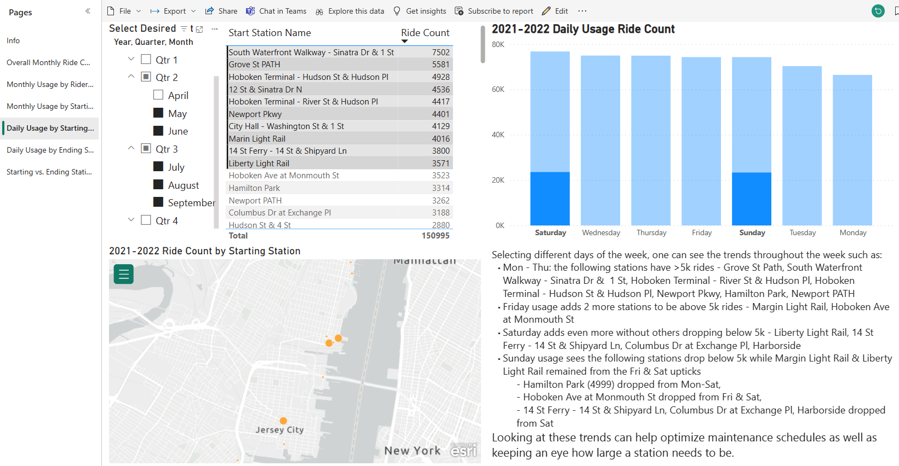

### Daily Usage by Ending Station

The map with stations having < 250 ride count is static to show the long tail of end points of rides while the map with stations showing count > 55 filters with the other features of the report

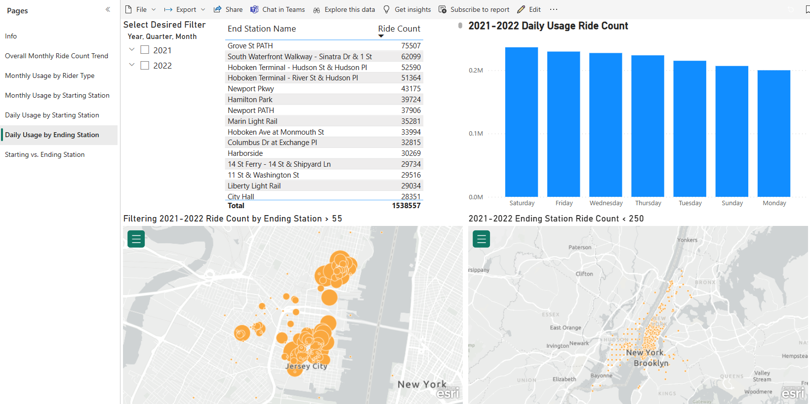

Selecting the top 10 stations by count during the *winter* week 2022 | Selecting the top 10 stations by count on the *winter* weekend
:-------------------------:|:-------------------------:
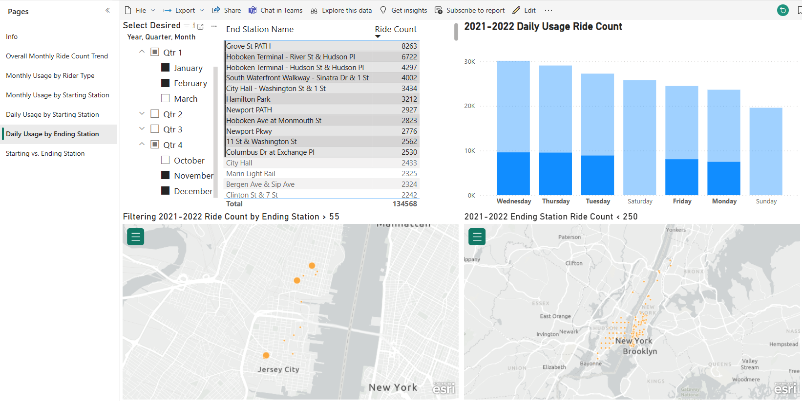  |  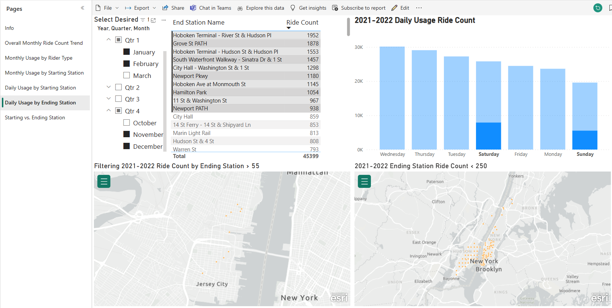

### Starting vs. Ending Station

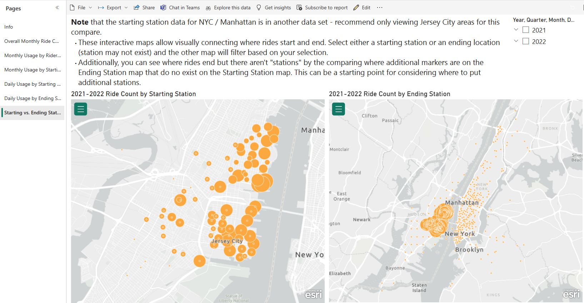

Selecting the Grove St station on the Starting Station map in 2022 | Selecting the Grove St station on the Ending Station map in 2022
:-------------------------:|:-------------------------:
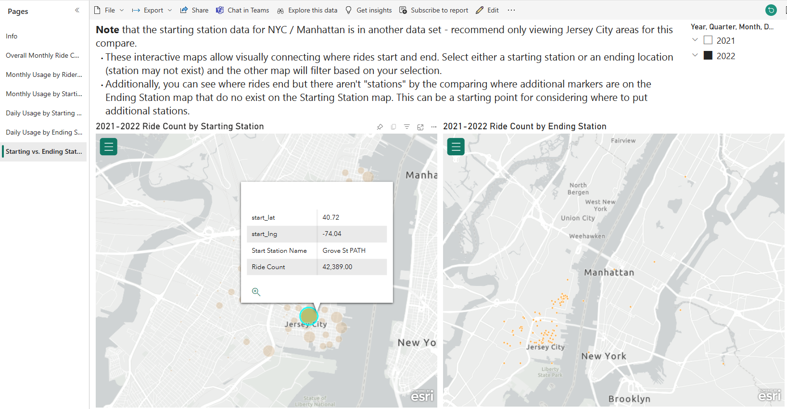  |  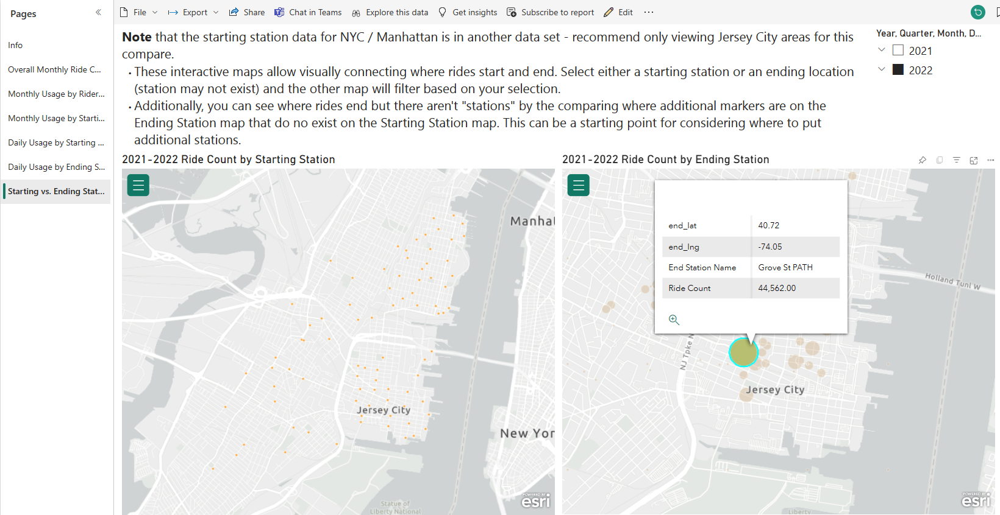